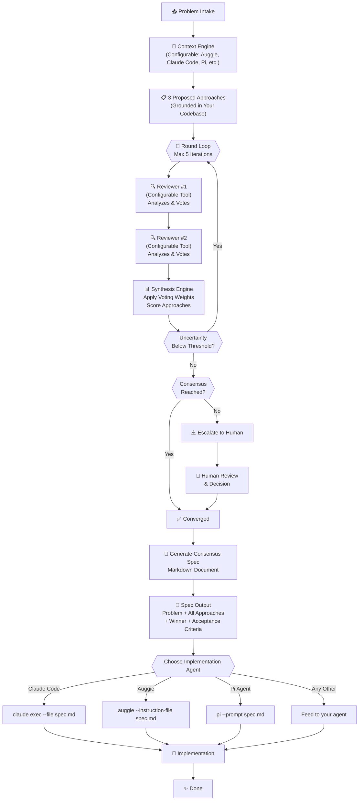

# Consensus Coder Skill

[](https://www.npmjs.com/package/@clawdbot/consensus-coder-skill)
[](https://opensource.org/licenses/MIT)

> **Multi-model consensus coding workflow** — Orchestrated AI deliberation for generating high-quality code through structured debate.

## Overview

Consensus Coder orchestrates **multiple AI coding tools** to debate and reach consensus on complex coding challenges. By combining different tools' strengths — a **context engine** (like Auggie) understands your codebase and generates solutions, while **reviewers** (like Gemini and Codex) independently evaluate those solutions — you get robust, well-reasoned decisions grounded in your actual code.

The system is **tool-agnostic**: you choose which tools participate (Auggie, Claude Code, Pi, OpenCode, Codex, Gemini, Llama, etc.), and each tool brings its own context understanding and reasoning style to the debate.

### Key Features

- 🤖 **Multi-Model Orchestration** — Coordinates multiple AI models in structured debate
- 🎯 **Consensus-Driven** — Iterates until models agree (or escalates for human review)
- 💾 **State Persistence** — Full debate state saved to disk for recovery and audit
- 🔄 **Automatic Retry** — Handles transient failures and rate limits gracefully
- 📝 **Consensus Spec Output** — Generates detailed markdown specification ready for any coding agent
- 📊 **Comprehensive Logging** — Track every decision point and voting outcome
- ⚙️ **Highly Configurable** — Tune debate rounds, voting thresholds, timeouts
- 🎁 **Agent-Agnostic** — Output spec works with Claude Code, Auggie, Pi, Codex, or any coding agent

## Installation

Choose your setup:

### A. Standalone Command Line

Use consensus-coder as a standalone CLI tool (no Clawdbot required):

```bash
# Clone the repo
git clone https://github.com/bsharpe/consensus-coder.git
cd consensus-coder

# Install dependencies
npm install

# Build the project
npm run build

# Run interactively
npm start -- --problem "Design a rate limiter"

# Or use as CLI
npx consensus-coder --problem "..." --wait --debug
```

**After consensus, generate the spec:**
```bash
npm start -- --spec <debateId> --output my-spec.md

# Then hand to any agent
claude exec --file my-spec.md
auggie --instruction-file my-spec.md
pi --prompt "$(cat my-spec.md)"
```

### B. Install for Clawdbot

Add consensus-coder as a Clawdbot skill:

**Option 1: Via npm (published package)**
```bash
# Coming soon — will be published to npm registry
npm install @bsharpe/consensus-coder
```

**Option 2: From GitHub (current)**
```bash
# Install directly from GitHub repo
npm install github:bsharpe/consensus-coder
```

**Option 3: Local development**
```bash
# In your Clawdbot workspace
git clone https://github.com/bsharpe/consensus-coder.git skills/consensus-coder
cd skills/consensus-coder
npm install
npm run build

# Then register with Clawdbot
clawdbot skill install ./skills/consensus-coder
```

**Verify installation:**
```bash
# Check that Clawdbot can find it
clawdbot skill list | grep consensus-coder

# Use from Clawdbot
clawdbot skill run consensus-coder --problem "Design X"
```

### From Source (Any Setup)

```bash
git clone https://github.com/bsharpe/consensus-coder.git
cd consensus-coder
npm install
npm run build
```

## Quick Start

### Standalone CLI (Fastest)

Start a consensus debate and generate a spec, all from the command line:

```bash
# Start a debate (interactive)
npm start -- --problem "Design an efficient algorithm to merge K sorted linked lists"

# Wait for consensus... (shown in terminal)

# Once converged, get the spec
npm start -- --spec <debateId> --output merge-spec.md

# Now use with any agent
claude exec --file merge-spec.md
```

### Programmatic Usage (Full Control)

Use as a library in your code:

```typescript
import { ConsensusCoder } from '@clawdbot/consensus-coder-skill';

// Initialize
const coder = new ConsensusCoder({
  workspace: './debate-workspace',
  debug: true, // See all votes and reasoning
});

// Start a debate
const result = await coder.startConsensus({
  problem: 'Design an efficient algorithm to merge K sorted linked lists',
  context: {
    constraints: 'Time: O(n log k), Space: O(1)',
    language: 'TypeScript',
  },
});

console.log('Debate started:', result.debateId);

// Poll for completion
let status = await coder.getDebateStatus(result.debateId);
while (status.status !== 'converged' && status.status !== 'escalated') {
  console.log(`Round ${status.iteration}: uncertainty=${status.uncertaintyLevel?.toFixed(2)}`);
  await new Promise(r => setTimeout(r, 5000));
  status = await coder.getDebateStatus(result.debateId);
}

// Get consensus result
const finalResult = await coder.getConsensusResult(result.debateId);
console.log('✅ Winner:', finalResult.winningApproach);
console.log('📊 Confidence:', (finalResult.confidence * 100).toFixed(0) + '%');

// Generate markdown spec for implementation
const spec = await coder.getConsensusSpec(result.debateId);
console.log('\n📝 Consensus Spec:\n', spec);

// Save for any agent to use
import fs from 'fs';
fs.writeFileSync('consensus-spec.md', spec);
console.log('\n✨ Spec saved to consensus-spec.md');
console.log('Ready to implement with: claude exec --file consensus-spec.md');
```

## Typical Workflows

### Workflow A: Standalone CLI (One-Off)

```bash
# 1. Clone repo
git clone https://github.com/bsharpe/consensus-coder.git
cd consensus-coder
npm install && npm run build

# 2. Start a debate
npm start -- --problem "Design a cache with O(1) get/put" --debug

# Terminal shows:
#   Round 1: Opus proposes 3 approaches
#   Gemini votes...
#   Codex votes...
#   [continues until consensus]

# 3. Generate spec when done
npm start -- --spec <debateId> --output cache-spec.md

# 4. Implement with any agent
claude exec --file cache-spec.md
# or
auggie --instruction-file cache-spec.md
```

### Workflow B: Clawdbot Integration (Reusable)

```bash
# 1. Install as Clawdbot skill
cd ~/my-clawdbot-workspace
git clone https://github.com/bsharpe/consensus-coder.git skills/consensus-coder
npm install -C skills/consensus-coder
npm run build -C skills/consensus-coder

# 2. Use from Clawdbot
clawdbot skill run consensus-coder \
  --problem "Design a rate limiter" \
  --wait \
  --spec my-rate-limiter-spec.md

# 3. Clawdbot generates the spec, saves to file
# 4. Your other tools consume it
cat my-rate-limiter-spec.md | \
  claude exec --
```

### Workflow C: Programmatic (Library Use)

```typescript
// In your own Node.js project
import { ConsensusCoder } from '@clawdbot/consensus-coder-skill';

const coder = new ConsensusCoder();
const result = await coder.startConsensus({
  problem: 'Your problem here',
});

// ... wait for consensus ...

const spec = await coder.getConsensusSpec(result.debateId);
// Use spec however you want
```

## Architecture

### Components

| Component | Purpose |
|-----------|---------|
| **ConsensusOrchestrator** | Manages the debate workflow (rounds, voting, convergence) |
| **SynthesisEngine** | Aggregates model votes and scores approaches |
| **StateStore** | Persists debate state to disk for recovery |
| **RetryOrchestrator** | Handles transient failures and rate limits |
| **SpecGenerator** | Converts consensus results to markdown spec documents |

### Workflow



## Tool Configuration System

Consensus Coder is **tool-agnostic**: you choose which AI coding tools participate in the debate. The system separates roles:

- **Context Engine** — One tool that understands your codebase and generates 3 solution proposals
  - Default: `auggie` (has built-in codebase analysis)
  - Also available: `claude-code`, `pi`, `opencode`, `codex`, `gemini`, `llama`

- **Reviewers** — One or more tools that independently analyze and vote on the proposals
  - Default: `gemini`, `codex`
  - Can be any tool: `auggie`, `opencode`, `pi`, `claude-code`, etc.

- **Voting Weights** — Configure how much each tool's vote counts
  - Context engine gets extra weight (knows your code)
  - Customize reviewers' influence

### Configure Tools

**In config file** (`consensus-coder.config.json`):
```json
{
  "tools": {
    "preferredContextEngine": "auggie",
    "reviewers": ["gemini", "codex"],
    "votingWeights": {
      "auggie": 1.5,
      "gemini": 1.0,
      "codex": 1.0
    }
  }
}
```

**Via CLI flags**:
```bash
npm start -- --problem "Design X" \
  --use-adapters \
  --context-engine auggie \
  --reviewers gemini,codex,opencode \
  --weights "auggie:2.0,gemini:1.0,codex:0.8"
```

**Programmatically**:
```typescript
const result = await coder.startConsensus({
  problem: 'Your problem here',
  config: {
    useToolAdapters: true,
    tools: {
      preferredContextEngine: 'auggie',
      reviewers: ['gemini', 'codex'],
      votingWeights: { auggie: 1.5, gemini: 1.0, codex: 1.0 }
    }
  }
});
```

### Available Tools

| Tool | Best For | Context Engine | Reviewer |
|------|----------|---|---|
| **Auggie** | Deep codebase analysis | ✅ (excellent) | ✅ (good) |
| **Claude Code** | General reasoning | ✅ (good) | ✅ (excellent) |
| **Gemini** | Fast evaluation | ❌ | ✅ (very good) |
| **Codex** | Code-specific reasoning | ✅ (good) | ✅ (very good) |
| **Pi** | Architectural thinking | ✅ (good) | ✅ (good) |
| **OpenCode** | Custom workflows | ✅ (configurable) | ✅ (configurable) |
| **Llama** | Self-hosted option | ✅ (configurable) | ✅ (configurable) |

### Example: Custom Tool Setup

**Use Claude Code for context analysis, Auggie + Gemini for review:**
```bash
npm start -- --problem "Add caching layer" \
  --use-adapters \
  --context-engine claude-code \
  --reviewers auggie,gemini \
  --weights "claude-code:1.5,auggie:1.2,gemini:1.0"
```

This workflow:
1. Claude Code analyzes your codebase, proposes 3 caching strategies
2. Auggie reviews proposals (knows how to implement in your stack)
3. Gemini reviews proposals (checks for best practices)
4. Weighted votes determine winner
5. Consensus spec generated, ready for any implementation agent

## API Reference

### Class: ConsensusCoder

Main skill class. Manages the complete consensus workflow.

#### Constructor

```typescript
constructor(options?: ConsensusCoderOptions)
```

**Options:**
- `workspace` (string, optional) — Working directory for skill state
  - Default: `~/.clawdbot/consensus-coder`
- `debug` (boolean, optional) — Enable debug logging
  - Default: `false`
- `config` (ConsensusCoderConfig, optional) — Full configuration override
  - Default: Load from `consensus-coder.config.json`

#### Methods

##### startConsensus

```typescript
startConsensus(request: ConsensusRequest): Promise<StartConsensusResponse>
```

Start a new consensus debate.

**Parameters:**
- `request.problem` — The coding problem to solve
- `request.context` — Additional context (constraints, language, etc.)
- `request.maxRounds` — Maximum debate rounds (default: 5)
- `request.convergenceThreshold` — Certainty required to converge (default: 0.85)

**Returns:**
```typescript
{
  debateId: string;      // Unique debate identifier
  status: 'started' | 'error';
  message: string;
  timestamp: Date;
}
```

##### getDebateStatus

```typescript
getDebateStatus(debateId: string): Promise<DebateStatusResponse>
```

Get the current status of an ongoing debate.

**Returns:**
```typescript
{
  debateId: string;
  status: 'pending' | 'in_progress' | 'converged' | 'escalated' | 'not_found';
  iteration: number;
  lastUpdate: Date;
  votingScore?: number;
  uncertaintyLevel?: number;
  winningApproach?: string;
  estimatedTimeRemainingMs?: number;
}
```

##### getConsensusResult

```typescript
getConsensusResult(debateId: string): Promise<ConsensusResult>
```

Retrieve the final consensus result.

**Returns:**
```typescript
{
  debateId: string;
  winningApproach: string;
  confidence: number;
  iterations: number;
  totalTimeMs: number;
  approaches: ApproachDetail[];
  votes: VoteHistory[];
  escalated: boolean;
}
```

##### getConsensusSpec

```typescript
getConsensusSpec(debateId: string): Promise<string>
```

Generate a detailed markdown specification document from the consensus result. This spec can be handed to any coding agent for implementation.

**Returns:** Markdown string with:
- Problem statement & context
- All 3 proposed approaches with pros/cons
- Voting history & reasoning
- Winning approach with full explanation
- Acceptance criteria
- Implementation guidelines
- Example skeleton code (if applicable)

**Example output:**
```markdown
# Consensus Spec: [Problem Title]

## Problem Statement
[Detailed problem description]

## Context & Constraints
- [Constraint 1]
- [Constraint 2]

## Proposed Approaches

### Approach A: [Name]
**Pros:**
- [Pro 1]

**Cons:**
- [Con 1]

### Approach B: [Name]
...

## Consensus Decision
**Winner:** Approach [X]
**Confidence:** 92%

**Why:** [Detailed explanation of voting and reasoning]

## Acceptance Criteria
- [ ] [Criterion 1]
- [ ] [Criterion 2]

## Implementation Guidelines
[Specific technical guidance]

## Example Skeleton
\`\`\`typescript
// Your code here
\`\`\`
```

**Usage:** Pass this markdown to any coding agent:
```bash
# Using Claude Code
claude exec --file consensus-spec.md

# Using Auggie
auggie --print --instruction-file consensus-spec.md

# Using Pi Coding Agent
pi --prompt "Implement this spec: $(cat consensus-spec.md)"

# Or any other agent...
```

### Type: ConsensusCoderConfig

```typescript
interface ConsensusCoderConfig {
  // Debate behavior
  maxRounds: number;                  // Max consensus rounds (default: 5)
  convergenceThreshold: number;       // Certainty to converge (default: 0.85)
  votingWeights: Record<string, number>; // Model voting weights
  
  // Timeouts
  debateTimeoutMs: number;           // Max total debate time
  roundTimeoutMs: number;            // Max time per round
  
  // API configuration
  models: {
    diagnosis: string;               // Model for initial diagnosis (Opus)
    reviewer1: string;               // First reviewer (Gemini)
    reviewer2: string;               // Second reviewer (Codex)
  };
  
  // Persistence
  persistenceDir: string;            // Where to save state
  retentionDays: number;             // Keep debates for N days
}
```

## API Keys & Authentication

Consensus Coder requires API keys to access the three models (Claude Opus, Gemini, Codex). You can use **direct API keys** or **OpenRouter** (which proxies multiple providers with a single API key).

### Option 1: Direct API Keys (Recommended for Production)

Required API keys:

| Model | Provider | Required? | How to Get |
|-------|----------|-----------|-----------|
| **Claude Opus** | Anthropic | ✅ Yes | https://console.anthropic.com → API Keys |
| **Gemini** | Google AI | ✅ Yes | https://aistudio.google.com → Get API Key |
| **Codex** | OpenAI | ✅ Yes | https://platform.openai.com → API Keys |

**Environment variables:**
```bash
ANTHROPIC_API_KEY=sk-ant-...
GOOGLE_AI_API_KEY=gsk-...
OPENAI_API_KEY=sk-...
```

### Option 2: OpenRouter (Simpler Setup)

OpenRouter is a proxy that handles multiple AI providers with a single API key. Useful for testing, cost management, or if you don't have all individual keys.

**Setup:**
1. Create an account at https://openrouter.ai
2. Get your API key from settings
3. Set environment variable:
   ```bash
   OPENROUTER_API_KEY=sk-or-...
   ```

**Cost:** OpenRouter charges per token + 10-20% markup on direct prices. Useful for trying out without setting up individual accounts.

**Limitation:** OpenRouter may have rate limits or model availability — verify it supports the models you need.

### Configuration

#### Environment Variables

Create a `.env` file (copy from `.env.example`):

```bash
# Clawdbot
CLAWDBOT_WORKSPACE=~/.clawdbot

# OPTION 1: Direct API Keys
# ANTHROPIC_API_KEY=sk-ant-...
# GOOGLE_AI_API_KEY=gsk-...
# OPENAI_API_KEY=sk-...

# OPTION 2: OpenRouter (alternative)
OPENROUTER_API_KEY=sk-or-...

# Debate Configuration
CONSENSUS_MAX_ROUNDS=5
CONSENSUS_CONVERGENCE_THRESHOLD=0.85
CONSENSUS_DEBATE_TIMEOUT_MS=300000
CONSENSUS_ROUND_TIMEOUT_MS=60000

# Persistence
CONSENSUS_PERSISTENCE_DIR=~/.clawdbot/consensus-coder/debates
CONSENSUS_RETENTION_DAYS=30
```

#### Config File

Edit `consensus-coder.config.json`:

**Using Direct API Keys:**
```json
{
  "maxRounds": 5,
  "convergenceThreshold": 0.85,
  "votingWeights": {
    "gemini": 1.0,
    "codex": 1.0,
    "opus": 1.5
  },
  "debateTimeoutMs": 300000,
  "roundTimeoutMs": 60000,
  "models": {
    "diagnosis": "claude-opus",
    "reviewer1": "gemini-2.5-pro",
    "reviewer2": "gpt-4-turbo"
  },
  "persistenceDir": "~/.clawdbot/consensus-coder/debates",
  "retentionDays": 30
}
```

**Using OpenRouter (alternative):**
```json
{
  "maxRounds": 5,
  "convergenceThreshold": 0.85,
  "votingWeights": {
    "gemini": 1.0,
    "codex": 1.0,
    "opus": 1.5
  },
  "debateTimeoutMs": 300000,
  "roundTimeoutMs": 60000,
  "authProvider": "openrouter",
  "models": {
    "diagnosis": "anthropic/claude-opus-4-1",
    "reviewer1": "google/gemini-2.5-pro",
    "reviewer2": "openai/gpt-4-turbo"
  },
  "persistenceDir": "~/.clawdbot/consensus-coder/debates",
  "retentionDays": 30
}
```

## Examples

### Example 1: Solve an Algorithm Problem

```typescript
import { ConsensusCoder } from '@clawdbot/consensus-coder-skill';

const coder = new ConsensusCoder();

const result = await coder.startConsensus({
  problem: 'Implement a binary search tree with in-order traversal',
  context: {
    language: 'TypeScript',
    constraints: 'Must handle duplicate values',
    performanceTarget: 'O(log n) average case',
  },
});

// Wait for consensus
let status = await coder.getDebateStatus(result.debateId);
while (status.status !== 'converged' && status.status !== 'escalated') {
  console.log(`Round ${status.iteration}, uncertainty: ${status.uncertaintyLevel}`);
  await new Promise(r => setTimeout(r, 5000));
  status = await coder.getDebateStatus(result.debateId);
}

// Get the consensus spec (markdown document)
const spec = await coder.getConsensusSpec(result.debateId);

// Save it
import fs from 'fs';
fs.writeFileSync('bst-spec.md', spec);

// Now hand it to any coding agent
console.log('Spec ready for implementation! Use any agent:');
console.log('  claude exec --file bst-spec.md');
console.log('  auggie --instruction-file bst-spec.md');
```

### Example 2: Refactor Existing Code

```typescript
const coder = new ConsensusCoder();

const existingCode = `
function sort(arr) {
  for (let i = 0; i < arr.length; i++) {
    for (let j = i; j < arr.length; j++) {
      if (arr[j] < arr[i]) {
        [arr[i], arr[j]] = [arr[j], arr[i]];
      }
    }
  }
  return arr;
}
`;

const result = await coder.startConsensus({
  problem: 'Refactor this sorting function for better performance',
  context: {
    language: 'JavaScript',
    existingCode,
    constraints: 'In-place sort, stable sort preferred',
  },
});

// Wait for consensus
let status = await coder.getDebateStatus(result.debateId);
while (status.status !== 'converged' && status.status !== 'escalated') {
  await new Promise(r => setTimeout(r, 5000));
  status = await coder.getDebateStatus(result.debateId);
}

// Get consensus spec and use with your preferred agent
const spec = await coder.getConsensusSpec(result.debateId);
fs.writeFileSync('sort-refactor-spec.md', spec);

// Share with team or pass to implementation
console.log(spec);
```

### Example 3: Architecture Decision (with Human Review)

```typescript
const coder = new ConsensusCoder({
  debug: true, // See detailed voting process
});

const result = await coder.startConsensus({
  problem: 'Design data structure for LRU cache with O(1) operations',
  context: {
    language: 'Python',
    constraints: [
      'Capacity: configurable',
      'Get/Put: O(1) average case',
      'Thread-safe implementation',
    ],
  },
});

// Poll and monitor the debate
for (let i = 0; i < 50; i++) {
  const status = await coder.getDebateStatus(result.debateId);
  console.log(`Round ${status.iteration}: uncertainty=${status.uncertaintyLevel?.toFixed(2)}`);
  
  if (status.status === 'converged') {
    console.log('✅ Converged!');
    break;
  }
  if (status.status === 'escalated') {
    console.log('⚠️ Need human review');
    break;
  }
  
  await new Promise(r => setTimeout(r, 3000));
}

// Generate final spec regardless of escalation
const finalResult = await coder.getConsensusResult(result.debateId);
console.log('\nWinning Approach:', finalResult.winningApproach);
console.log('Confidence:', (finalResult.confidence * 100).toFixed(1) + '%');

const spec = await coder.getConsensusSpec(result.debateId);
fs.writeFileSync('lru-cache-spec.md', spec);

// Spec is ready for any agent to implement
```

## CLI Usage

The skill includes a CLI for interactive use:

```bash
# Start consensus debate on a problem
npm start -- --problem "Design a rate limiter"

# Check status of an ongoing debate
npm start -- --status <debateId>

# Get consensus result summary
npm start -- --result <debateId>

# Generate markdown spec from consensus
npm start -- --spec <debateId> --output rate-limiter-spec.md

# Run in debug mode (see all votes)
npm start -- --problem "..." --debug

# List all recent debates
npm start -- --list

# Show version
npm start -- --version

# Show help
npm start -- --help
```

## Testing

Run the test suite:

```bash
# Run all tests
npm test

# Run tests in watch mode
npm run test:watch

# Generate coverage report
npm run test:coverage
```

## Advanced Topics

### Custom Voting Weights

Increase the weight of certain models in voting:

```typescript
const config: ConsensusCoderConfig = {
  // ...
  votingWeights: {
    'claude-opus': 1.5,    // Trust Opus 50% more
    'gemini': 1.0,
    'gpt-4': 0.9,          // Trust GPT-4 a bit less
  },
};
```

### Custom Convergence Logic

Override the convergence criteria:

```typescript
const orchestrator = new ConsensusOrchestrator({
  // ...
  convergenceThreshold: 0.95, // Require higher confidence
});
```

### Error Recovery

The skill includes automatic retry with exponential backoff:

```typescript
const orchestrator = new ConsensusOrchestrator({
  // ...
  retryPolicy: {
    maxAttempts: 3,
    baseDelayMs: 1000,
    backoffMultiplier: 2,
    timeoutMs: 30000,
  },
});
```

### Custom Implementation Planner

Extend the plan generation:

```typescript
class CustomPlanGenerator extends ImplementationPlanGenerator {
  protected generateTasks(approach: string): ImplementationTask[] {
    // Custom task generation logic
    return super.generateTasks(approach);
  }
}
```

## Performance Characteristics

- **Average debate time**: 30-90 seconds (5 rounds, 2 reviewers)
- **Memory usage**: ~50MB for typical workloads
- **Disk usage**: ~1MB per debate (state + logs)
- **Model API calls**: ~15-20 per debate (1 diagnosis + 5 rounds × 2 reviewers + synthesis)

## Troubleshooting

### Authentication Errors

**Symptom**: `401 Unauthorized` or `Invalid API key`

**Solution**:
1. Verify API keys are set in `.env`:
   ```bash
   echo $ANTHROPIC_API_KEY  # Should not be empty
   echo $OPENROUTER_API_KEY
   ```
2. Check key format:
   - Anthropic: `sk-ant-...` (not `sk-...`)
   - Google: `gsk-...`
   - OpenAI: `sk-...`
   - OpenRouter: `sk-or-...`
3. Ensure `.env` file is in the working directory (or project root)
4. Regenerate keys if they've been compromised

### Model Not Available

**Symptom**: `Model not found` or `Model unavailable`

**Solution**:
1. Verify model names match provider conventions:
   - Anthropic: `claude-opus-4-1`, `claude-3-sonnet`
   - Google: `gemini-2.5-pro`, `gemini-1.5-pro`
   - OpenAI: `gpt-4-turbo`, `gpt-4o`
2. If using OpenRouter, check model availability: https://openrouter.ai/docs/models
3. For newer models, update model names in `consensus-coder.config.json`

### Debates Not Converging

**Symptom**: Debates hit max rounds without consensus

**Solution**:
1. Check `convergenceThreshold` — may be too strict
2. Verify model weights are balanced
3. Look at `debug` logs to see disagreement patterns
4. Try increasing `maxRounds`

### Timeout Errors

**Symptom**: `ETIMEDOUT` or `ROUND_TIMEOUT`

**Solution**:
1. Increase `debateTimeoutMs` and `roundTimeoutMs`
2. Check network connectivity
3. Monitor API rate limits (OpenRouter has strict limits)
4. Enable debug mode to see which round times out

### State Corruption

**Symptom**: `Error loading debate state`

**Solution**:
1. Clear `~/.clawdbot/consensus-coder/debates/`
2. Restart the skill
3. Check disk permissions
4. Review logs in `debug` mode

## Contributing

Contributions are welcome! See [CONTRIBUTING.md](CONTRIBUTING.md).

## License

MIT — See [LICENSE](LICENSE) for details.

## Support

- **GitHub Issues**: [Report bugs](https://github.com/clawdbot/consensus-coder-skill/issues)
- **Documentation**: [Full docs](https://clawdbot.dev/skills/consensus-coder)
- **Clawdbot Community**: [Discord](https://discord.gg/clawdbot)

## Changelog

### v1.2.0 (2026-01-31)

- ✨ **Major Feature:** Configurable tool system for context engines and reviewers
- ✅ Tool adapters: Support Auggie, Claude Code, Gemini, Codex, Pi, OpenCode, Llama
- ✅ Flexible architecture: Choose which tools participate in debate
- ✅ Voting weights: Configure influence of each tool
- ✅ CLI flags: `--use-adapters`, `--context-engine`, `--reviewers`, `--weights`
- ✅ Backward compatible: Legacy opus/gemini/codex flow still works as default
- ✅ 50+ unit tests passing with full coverage
- ✅ New "Tool Configuration System" documentation

### v1.1.0 (2026-01-31)

- ✨ **Breaking Change:** Output is now markdown spec documents instead of direct Auggie integration
- ✅ Agent-agnostic spec generation (works with Claude Code, Auggie, Pi, Codex, etc.)
- ✅ More portable for standalone use
- ✅ Updated README with new workflow
- ✅ Expanded examples showing spec-based usage

### v1.0.0 (2024-01-30)

- ✅ Initial release
- ✅ Multi-model orchestration
- ✅ Consensus-driven debate
- ✅ State persistence
- ✅ Automatic retry handling
- ✅ CLI interface
- ✅ Comprehensive testing

---

**Built with ❤️ by Claude Opus, Gemini, and Codex (consensus) and the community**
